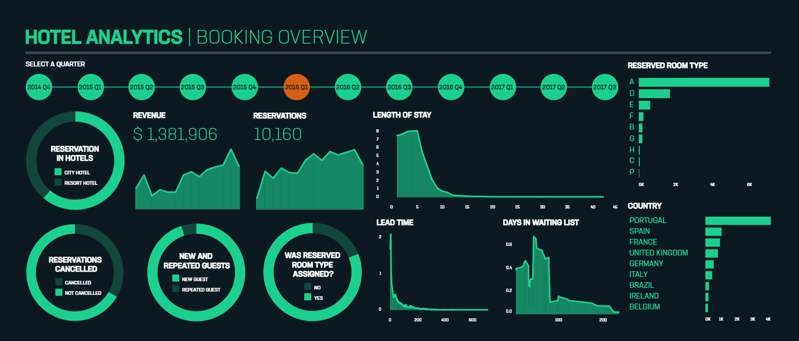

 
  

In this project, I have attempted to analyze a hotel booking dataset and come up with some relevant conclusions about the factors that contribute to count of bookings. No personal information of customer is provided in this dataset.

## :floppy_disk: Project Files Description</h2>

This project contains an executable iPython Notebook, presentation and source files as follows:

<h4>Executable Files:</h4>
<ul>
  <li><b>EDA_Hotel_Booking_Analysis_Capstone_Project.ipynb</b> - Google Colab notebook containing data summary, exploration, visualisations and conclusion.</li>
</ul>

<h4>Documentation:</h4>
<ul>
  <li><b>Presentation PDF - EDA - Hotel Booking Analysis - Capstone Project.pdf</b> - Presentation slideshow of the project.</li>
</ul>

<h4>Source Directory:</h4>
<ul>
  <li><b>Data & Resources.zip</b> - Includes booking data  for both hotels.</li>
</ul>

## :book: Problem Statement

A dataset containing 119390 records across 32 features has been given with information regarding bookings of two hotels from July 2015 to August 2017. These two hotels are City Hotel and Resort Hotel.

The main objective is to explore the given dataset and discover the factors which govern the bookings. The dataset will be analyzed and from the conclusions drawn from it will be used to recognize the missteps taken by the manager. With this information, hotels will be equipped to improve their performance.

Data analysis is performed to answer the following questions:
<li>Which hotel is more preferred among travelers?</li>
<li>Which hotel retains more customers?</li>
<li>Which is the busiest month?</li>
<li>Which is the most popular room type?</li>
<li>From which country the greatest number of bookings were made?</li>
<li>How Long People Stay in the hotel?</li>
<li>How many bookings were cancelled?</li>

## :book: Approach

1.	Understanding the business task.
2.	Import relevant libraries and define useful functions.
3.	Reading data from files given.
4.	Data inspection.
5.  Data cleaning.
6.	Exploratory data analysis, to find which factors affect the bookings and how they affect it.
7.	Conclusions drawn from analysis.

## :book: Exploratory Data Analysis

EDA was carried out in 3 steps:

### 📊 Univariate Analysis
Uni means one and variate means variable, so in univariate analysis, there is only one dependable variable. The objective of univariate analysis is to derive the data, define and summarize it, and analyze the pattern present in it. In a dataset, it explores each variable separately.
Univariate analyses were done on:
<li>Percentage of bookings in each hotel.</li>
<li>Percentage of repeated and non-repeated guests.</li>
<li>Percentage of bookings that got cancelled.</li>
<li>Number of bookings made for each room type.</li>
<li>Number of bookings made from each country.</li>
<li>For how long guests commonly stay in the hotel.</li>
<li>Number of bookings made in each month.</li>

### 📊 Bivariate Analysis
Bi means two and variate means variable, so here there are two variables. The analysis is related to cause and the relationship between the two variables.
Bivariate analyses were done on:
<li>Revenue generated by each hotel.</li>
<li>Percentage of repeated guests in each hotel.</li>
<li>Percentage of repeated guests in each distribution channel.</li>
<li>Percentage of cancelled and non-cancelled bookings in each hotel.</li>
<li>Number of cancelled and non-cancelled bookings among repeated and non-repeated guests.</li>
<li>Kernel density estimate of number of days in waiting list for cancelled and non-cancelled bookings.</li>
<li>Kernel density estimate of lead time for cancelled and non-cancelled bookings.</li>
<li>Number of bookings cancelled when reserved room type is the same and different as the assigned room type.</li>
<li>Percentage of cancelled and non-cancelled bookings in each distribution channel.</li>
<li>Change in the length of stay with the change in ADR.</li>
Charts used for univariate analyses are scatter plot, density plot, stacked bar chart and vertical bar chart.

### 📊 Correlation Analysis
It is used to measure the strength of the linear relationship between two variables and compute their association. Correlation analysis calculates the level of change in one variable due to the change in the other.
Correlation analysis of the dataset was carried out using a correlation heatmap with the features, 'lead_time', 'adr', 'total_guests', 'total_stays_in_nights', 'previous_cancellations', 
'booking_changes', 'days_in_waiting_list', 'required_car_parking_spaces', 'total_of_special_requests' and 'previous_bookings_not_canceled'.

### 📊 Data Visualization

An interactive dashboard was also created to display charts associated with the analysis.

Click [here](https://public.tableau.com/views/HotelBookingAnalysis_16716416454840/HotelBookingAnalysis?:language=en-US&:display_count=n&:origin=viz_share_link) to interact with the data visualization.

## 📘: Conclusion

The following conclusions were drawn from analysis:
<li>City Hotel seems to be more preferred among travelers and it also generates more revenue.</li>
<li>Most number of bookings are made in July and August.</li>
<li>Room Type A is the most preferred room type among travelers.</li>
<li>Most number of bookings are made from Portugal.</li>
<li>Most of the guest stays for 1-4 days in the hotels.</li>
<li>Resort Hotel retains a greater percentage of guests.</li>
<li>Around one-fourth of the total bookings gets cancelled. More cancellations are from City Hotel.</li>
<li>New guests tend to cancel bookings more than repeated customers.</li>
<li>Lead time, number of days in waiting list or assignation of reserved room to customer does not affect cancellation of bookings.</li>
<li>Corporate has the most percentage of repeated guests while TA/TO has the least whereas in the case of cancelled bookings TA/TO has the most percentage while Corporate has the least.</li>
<li>The length of the stay decreases as ADR increases probably to reduce the cost.</li>
<li>Visits planned with longer stays are booked earlier than those planned with shorter stay.</li>

## :scroll: Credits

Midhun R | Avid Learner | Data Analyst | Data Scientist | Machine Learning Enthusiast

 <i> Contact me for Data Science Project Collaborations</i>

## :books: References
<ul>
  <li>
GeeksforGeeks, 'Create a stacked bar plot in Matplotlib'. [Online].

      
Available: https://www.geeksforgeeks.org/create-a-stacked-bar-plot-in-matplotlib/

  </li>
  <li>
Medium, 'Seaborn Heatmap for Visualising Data Correlations'. [Online].

      
Available: https://towardsdatascience.com/seaborn-heatmap-for-visualising-data-correlations-66cbef09c1fe

  </li>
</ul>
